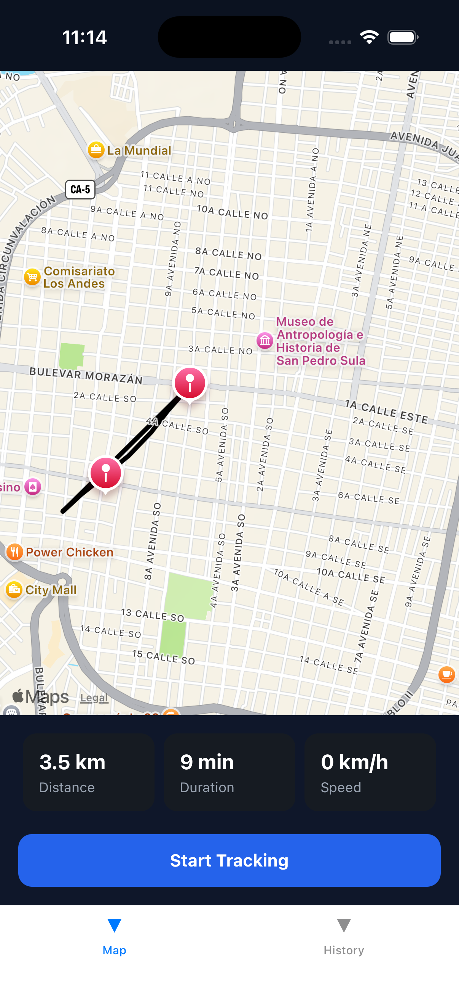
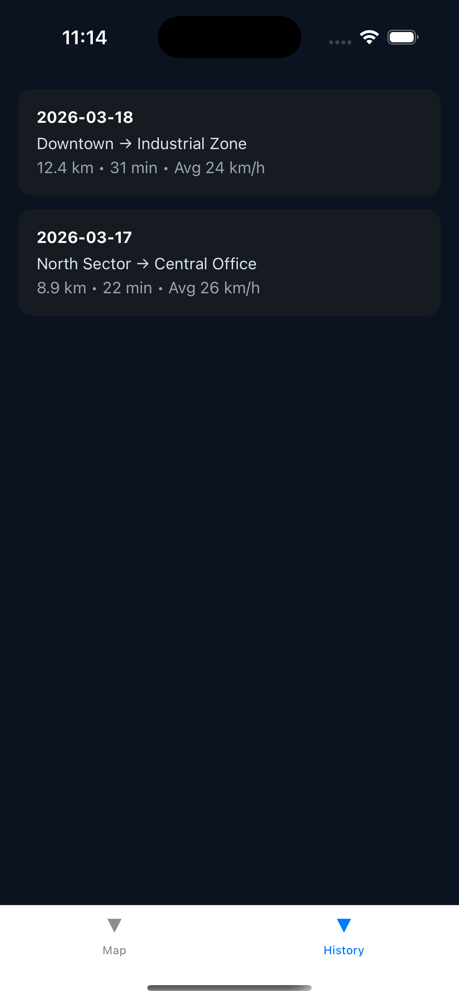

# 📍 React Native Tracking Demo

A mobile application that simulates real-time GPS tracking using React Native.

This project demonstrates map-based interfaces, live tracking logic, and mobile UI patterns commonly used in fleet management and location-based systems.

---

## 🚀 Features

- 📍 Map visualization using React Native Maps  
- 🔄 Simulated real-time location updates  
- 🧭 Route tracking with polyline rendering  
- 📊 Tracking stats (distance, duration, speed)  
- 🧾 Trip history screen  

---

## 🛠 Tech Stack

- React Native  
- TypeScript  
- React Navigation  
- React Native Maps  

---

## 📱 Screenshots



---

## 📦 Installation

```bash
git clone https://github.com/itsJaan/react-native-tracking-demo.git
cd react-native-tracking-demo
npm install